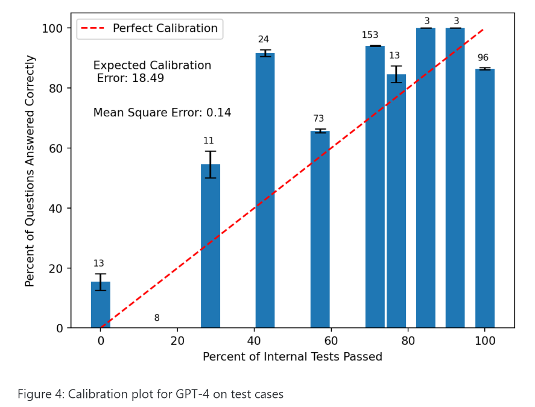

# LLM-Calibrated-Uncertainty-for-Code

 Repository for "Achieving Calibrated Uncertainty for Code Generation with Large Language Models."

**TLDR;** The percent of self-generated test cases that a model passes is decent measure of uncertainty for code generation in LLM's with an expected calibration error around 0.18 for both GPT-3.5 and GPT-4 evaluated on HumanEval.

Plot from the PDF of final report

**Future Directions:** Promising directions for future work would be to evaluate some of the uncertainty quantification methods discussed in the “Previous Work” session on the HumanEval dataset to have a more direct comparison between this and other methods for uncertainty quantification. Another direction for work would be to try to expand the domain of questions being asked beyond questions in HumanEval or even beyond strictly programming questions. For example I am currently attempting to reformat the well-know MATH dataset into a form where I could test this method of uncertainty quantification.

- **Final Report**/ folder contains html and PDF copies of a summary of the final report summarizing this work
- **calibration_plots.ipynb** - Code to create calibration plots for the finished runs
- **README.md**
- **reflexion.py** - Main code overseeing generation of functions and internal test cases. Works both for reflexion and without using reflexion
- **run_gen_5.sh** - Code to specify parameters for run. In these examples I generated 5 functions for each prompt
- **run_validate.sh** - Specify the run to validate when running validate_py_results.py
- **subset_human_eval.ipynb** - Code to generate subsets of HumanEval for training/testing
- **uncertainty_utils.py** - Helper functions for calibration_plots.ipynb
- **utils.py** - jsonl utils
- **validate_py_results.py** - Calculate the percent accuracy from the run specified in run_validate.sh (taking the generation with the best performance on internal test cases as the final answer for each prompt)
- **executors/** - functions to extract and execute the code from the language model responses. Improved from the "Mastering HumanEval Repository" to run faster with multiprocessing
- **generators/**  - functions to query language model
- **human-eval/** - the humaneval dataset and code to generate it

Feel free to reach out if you have any questions about the code or would be interested in collaborating on future work of this sort.

Acknowledgements: The base code for this repository is based off of "Mastering HumanEval with Reflexion" (https://github.com/GammaTauAI/reflexion-human-eval/tree/main).
